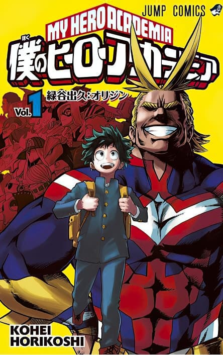

  <h1 style="font-size: 3.5rem; color: var(--md-primary-fg-color); text-shadow: 2px 2px 4px rgba(0,0,0,0.2);">
     АНИМЕ
  </h1>

<a href="anime/attack-on-titan.md" class="anime-card">
  

    
  

  

    <h3>Атака титанов</h3>
    
📅Год: 2013

    
⭐Сезонов: 4

        
✅Закончено?: Да

    
Человечество борется за выживание против гигантских титанов.

  

</a>

<a href="anime/hero-academia.md" class="anime-card">
  

    
  

  

    <h3>Моя геройская академия</h3>
    
📅Год: 2016

    
⭐Сезонов: 8

    
✅Закончено?: Да

    
В мире неожиданно появляются причуды и профессия героя.

  

</a>

<a href="anime/solo-leveling.md" class="anime-card">
  

    
  

  

    <h3>Соло-левелинг</h3>
    
📅 2024

    
⭐Сезонов: 2

    
❌Закончено?: Нет

    
Челик прокачивается в одиночку ...

  

</a>

<a href="anime/kaidzu.md" class="anime-card">
  

    
  

  

    <h3>Кайдзю №8</h3>
    
📅 2024

    
⭐Сезонов: 2

    
❌Закончено?: Нет

    
Мир, где постоянно появляются монстры-кайдзю.

  

</a>

<a href="anime/dandadan.md" class="anime-card">
  

    
  

  

    <h3>Дандадан</h3>
    
📅 2021

    
⭐Сезонов: 2

    
❌Закончено?: Нет

    
Момо и консперун учаться вместе, а дальше ...

  

</a>

